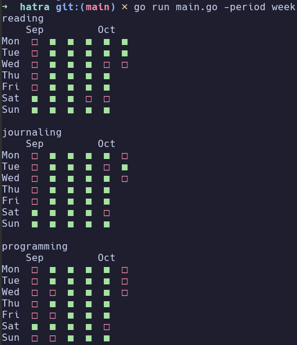
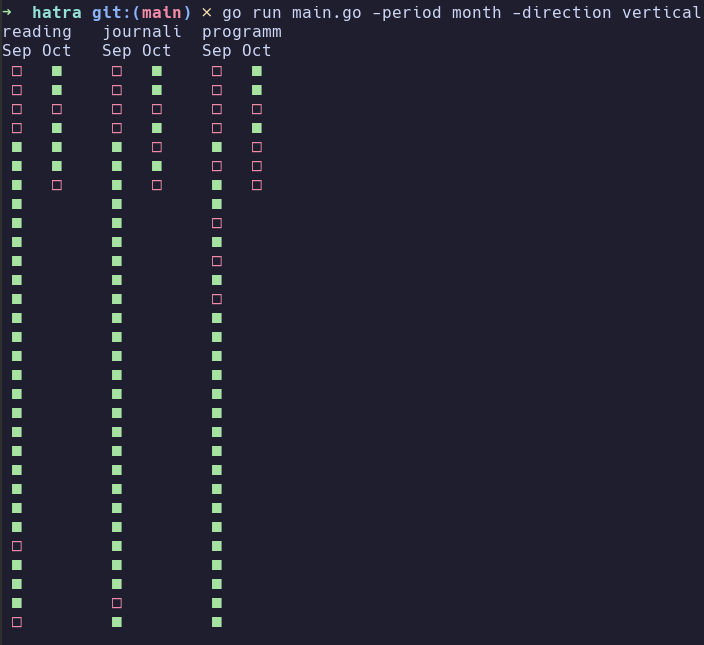

# hatra

A small CLI for habit tracking written in Go. It reads plain-text files of dates and draws each habit as a grid in your terminal, so you can see at a glance which days you did it and which you missed.

## Examples


<p>
    
    
</p>

## Requirements
 
Go 1.22 or newer.
 
## Usage
 
Run it from the repository root, since it reads habits from the `./data` folder:
 
```sh
go run .
```
 
Or build a binary and run it from the folder that contains `data/`:
 
```sh
go build -o hatra .
./hatra
```
 
### Options
 
| Flag | Values | Default | Description |
|---|---|---|---|
| `-direction` | `horizontal`, `vertical` | `horizontal` | How habits are laid out |
| `-period` | `month`, `week` | `month` | Group days by month, or by weekday and week |
| `-exclude` | comma-separated habit names | none | Habits to leave out |

## Data format
 
Each habit is a text file in `data/`, named after the habit:
 
```
data/
├── reading.txt
└── running.txt
```
 
Each line starts with a date, one line per day you did the habit:
 
```
2026-08-01
2026-08-02
2026-08-04
```
 
Only the first 10 characters of a line are read, so you can add a note after the date. Empty lines are ignored.
 
Habit names can contain letters, digits and underscores (no spaces or hyphens). The file name without `.txt` is what is shown as the habit name.
